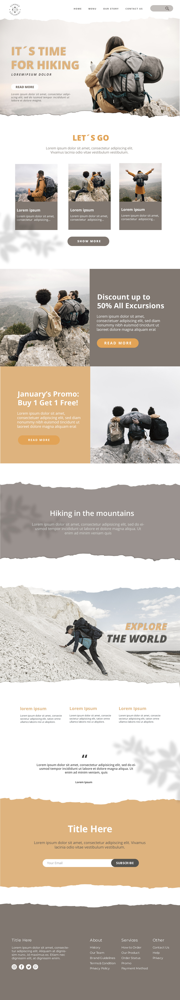

# summer-exploring
site single page - HTML+CSS+JS utilizando BOOTSTRAP

## Desafio
O desafio foi transformar em código um layout do site em imagem JPG  
Veja a imagem: 

## Consumo de APIs
Foi utilizado um código java para popular os campos
select com uma lista dos estados e após a seleção, é
carregado no select "cidades" uma lista com as cidades do estado selecionado.

## Bibliotecas utilizadas
- Bootstrap
- FontAwesome
- AOS Scroll Animation
- Google Fonts
- Etc
